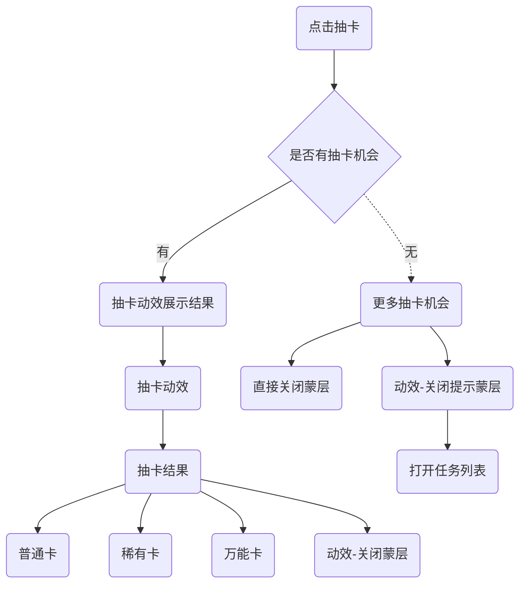

## flower集卡活动逻辑


### 抽卡逻辑


### 集卡逻辑

1. 每当用户抽到卡 => 判断是否集齐卡片 & 是否获得锦鲤
  1.1 是 => 恭喜集齐年味卡
    1.1.0 集齐动效
    1.1.1 UI(文案不同)
    1.1.2 分享（保存图片）
  1.2 集齐&不是锦鲤 => 恭喜集齐年味卡
    1.2.0 集齐动效
    1.2.1 UI(文案不同)
    1.2.2 分享（保存图片）
  1.3 否 => no action
2. 二阶段蒙层（当一阶段卡片集齐时，无法手动关闭）
  2.1 UI
  2.2 合成按钮
    2.2.1 愿望卡蒙层
3. 二阶段集卡（当二阶段每获得一张卡时 => 判断是否集齐 & 是否获取二阶段锦鲤）
  3.1 是
    3.1.1 恭喜集齐愿望卡蒙层

### 索卡/赠卡

Q&A
1. 实验是个什么意思？
2. 点击送重复卡 会有文案说明，好友领取获得1次抽卡机会（但是在卡片蒙层里面没有相关文案，对应两种赠卡渠道？）

1. 点击主会场卡片
  1.1 卡片蒙层
    1.1.1 UI
    1.1.2 区分一/二阶段
    1.1.3 集卡进度-数量
  1.2 卡片状态
    1.2.1 =0置灰 => 分享求赠卡
    1.2.2 =1点亮
    1.2.3 >1点亮，可赠卡 => 分享送卡
2. 点击<送重复卡>
  2.1 UI-展示所有重复卡（所得卡数量-1后数量>0）
  2.2 赠卡记录（待确认做不做）
    2.2.1 我送出/我收到的  头像昵称-卡片-时间-关注按钮

3. 用户回流
  3.1 被索取（口令）
    3.1.1 判断是否满足赠送条件（该卡片数量>1）
    3.1.2 无法赠予弹窗（数量不足）
    3.1.3 好友已拥有弹窗
    3.1.4 可以赠送ui => 点击成功赠送toast / 送晚了toast
  3.2 索取成功
    3.2.1 弹窗
  3.3 被赠予（口令）
    3.3.1 有领取资格（该卡片数量=0） => 收卡
    3.3.1 无领取资格（该卡片数量>1） => 不可领取
  3.4 赠予成功
    3.4.1 已赠送成功 => 赠送抽卡机会（这里要触发后台赠予信息）

### 任务面板

1. 路径
  1.1 主动点击调起
  1.2 无抽卡机会时调起
2. UI
3. 任务类型
  3.1 静态任务
  3.2 分享任务

### 有福同享（道具）玩法

Q&A
1. 集齐卡片但是没有合成的用户呢？
2. 如何判断可以绑定（对方是否集齐）？如果对方已集齐是否可以绑定

1. 策略控制开关（一阶段锦鲤大奖发放完毕）
2. 第一阶段卡片集齐的用户 => 有福同享弹窗
  2.1 主UI
  2.2 规则UI
3. action
  3.1 邀请好友
  3.2 先收下
4. 有福同享二级页
5. 用户已绑定有福同享道具
  5.1 主按钮下方增加状态
6. 回流 - 赠送方绑定成功 => 弹窗
7. 回流 - 接受方接收成功 => 弹窗 => 合成动效


```
{
  "code": 0,
  "data": {
    "date": [
      "2021-11-01 00:00:00",
      "2021-11-02 00:00:00",
      "2021-11-03 00:00:00",
      "2021-11-04 00:00:00",
      "2021-11-05 00:00:00",
      "2021-11-06 00:00:00",
      "2021-11-07 00:00:00"
    ],
    "metrics_series": [
      {
        "filter_id": "6be39c9597ab",
        "group_key_type": [
          0
        ],
        "metrics": [
          {
            "group_key": [
              {
                "float_key": 0,
                "group_key_value_type": 0,
                "int_key": 0,
                "string_key": "/starfish/review_query/backplay"
              }
            ],
            "metric_value": [
              {
                "decimal_value": "76",
                "int_array_value": [],
                "type": 1
              },
              {
                "decimal_value": "57",
                "int_array_value": [],
                "type": 1
              },
              {
                "decimal_value": "38",
                "int_array_value": [],
                "type": 1
              },
              {
                "decimal_value": "21",
                "int_array_value": [],
                "type": 1
              },
              {
                "decimal_value": "8",
                "int_array_value": [],
                "type": 1
              },
              {
                "decimal_value": "2",
                "int_array_value": [],
                "type": 1
              },
              {
                "decimal_value": "12",
                "int_array_value": [],
                "type": 1
              }
            ]
          },
          {
            "group_key": [
              {
                "float_key": 0,
                "group_key_value_type": 0,
                "int_key": 0,
                "string_key": "/starfish/review_query/anchor_home"
              }
            ],
            "metric_value": [
              {
                "decimal_value": "54",
                "int_array_value": [],
                "type": 1
              },
              {
                "decimal_value": "54",
                "int_array_value": [],
                "type": 1
              },
              {
                "decimal_value": "23",
                "int_array_value": [],
                "type": 1
              },
              {
                "decimal_value": "15",
                "int_array_value": [],
                "type": 1
              },
              {
                "decimal_value": "18",
                "int_array_value": [],
                "type": 1
              },
              {
                "decimal_value": "4",
                "int_array_value": [],
                "type": 1
              },
              {
                "decimal_value": "0",
                "int_array_value": [],
                "type": 1
              }
            ]
          },
          {
            "group_key": [
              {
                "float_key": 0,
                "group_key_value_type": 0,
                "int_key": 0,
                "string_key": "/starfish/review_query/room_home_page"
              }
            ],
            "metric_value": [
              {
                "decimal_value": "59",
                "int_array_value": [],
                "type": 1
              },
              {
                "decimal_value": "40",
                "int_array_value": [],
                "type": 1
              },
              {
                "decimal_value": "14",
                "int_array_value": [],
                "type": 1
              },
              {
                "decimal_value": "19",
                "int_array_value": [],
                "type": 1
              },
              {
                "decimal_value": "8",
                "int_array_value": [],
                "type": 1
              },
              {
                "decimal_value": "2",
                "int_array_value": [],
                "type": 1
              },
              {
                "decimal_value": "2",
                "int_array_value": [],
                "type": 1
              }
            ]
          },
          {
            "group_key": [
              {
                "float_key": 0,
                "group_key_value_type": 0,
                "int_key": 0,
                "string_key": "/starfish/review_flow"
              }
            ],
            "metric_value": [
              {
                "decimal_value": "43",
                "int_array_value": [],
                "type": 1
              },
              {
                "decimal_value": "37",
                "int_array_value": [],
                "type": 1
              },
              {
                "decimal_value": "8",
                "int_array_value": [],
                "type": 1
              },
              {
                "decimal_value": "11",
                "int_array_value": [],
                "type": 1
              },
              {
                "decimal_value": "4",
                "int_array_value": [],
                "type": 1
              },
              {
                "decimal_value": "0",
                "int_array_value": [],
                "type": 1
              },
              {
                "decimal_value": "2",
                "int_array_value": [],
                "type": 1
              }
            ]
          },
          {
            "group_key": [
              {
                "float_key": 0,
                "group_key_value_type": 0,
                "int_key": 0,
                "string_key": "/starfish/review_flow/mdim"
              }
            ],
            "metric_value": [
              {
                "decimal_value": "14",
                "int_array_value": [],
                "type": 1
              },
              {
                "decimal_value": "3",
                "int_array_value": [],
                "type": 1
              },
              {
                "decimal_value": "2",
                "int_array_value": [],
                "type": 1
              },
              {
                "decimal_value": "0",
                "int_array_value": [],
                "type": 1
              },
              {
                "decimal_value": "2",
                "int_array_value": [],
                "type": 1
              },
              {
                "decimal_value": "0",
                "int_array_value": [],
                "type": 1
              },
              {
                "decimal_value": "0",
                "int_array_value": [],
                "type": 1
              }
            ]
          },
          {
            "group_key": [
              {
                "float_key": 0,
                "group_key_value_type": 0,
                "int_key": 0,
                "string_key": "/starfish/review_flow/retrace"
              }
            ],
            "metric_value": [
              {
                "decimal_value": "3",
                "int_array_value": [],
                "type": 1
              },
              {
                "decimal_value": "8",
                "int_array_value": [],
                "type": 1
              },
              {
                "decimal_value": "1",
                "int_array_value": [],
                "type": 1
              },
              {
                "decimal_value": "5",
                "int_array_value": [],
                "type": 1
              },
              {
                "decimal_value": "2",
                "int_array_value": [],
                "type": 1
              },
              {
                "decimal_value": "0",
                "int_array_value": [],
                "type": 1
              },
              {
                "decimal_value": "0",
                "int_array_value": [],
                "type": 1
              }
            ]
          },
          {
            "group_key": [
              {
                "float_key": 0,
                "group_key_value_type": 0,
                "int_key": 0,
                "string_key": "/starfish/review_flow/flow"
              }
            ],
            "metric_value": [
              {
                "decimal_value": "3",
                "int_array_value": [],
                "type": 1
              },
              {
                "decimal_value": "0",
                "int_array_value": [],
                "type": 1
              },
              {
                "decimal_value": "0",
                "int_array_value": [],
                "type": 1
              },
              {
                "decimal_value": "6",
                "int_array_value": [],
                "type": 1
              },
              {
                "decimal_value": "2",
                "int_array_value": [],
                "type": 1
              },
              {
                "decimal_value": "0",
                "int_array_value": [],
                "type": 1
              },
              {
                "decimal_value": "0",
                "int_array_value": [],
                "type": 1
              }
            ]
          },
          {
            "group_key": [
              {
                "float_key": 0,
                "group_key_value_type": 0,
                "int_key": 0,
                "string_key": "/starfish/review_flow/deal"
              }
            ],
            "metric_value": [
              {
                "decimal_value": "5",
                "int_array_value": [],
                "type": 1
              },
              {
                "decimal_value": "3",
                "int_array_value": [],
                "type": 1
              },
              {
                "decimal_value": "2",
                "int_array_value": [],
                "type": 1
              },
              {
                "decimal_value": "0",
                "int_array_value": [],
                "type": 1
              },
              {
                "decimal_value": "0",
                "int_array_value": [],
                "type": 1
              },
              {
                "decimal_value": "0",
                "int_array_value": [],
                "type": 1
              },
              {
                "decimal_value": "0",
                "int_array_value": [],
                "type": 1
              }
            ]
          },
          {
            "group_key": [
              {
                "float_key": 0,
                "group_key_value_type": 0,
                "int_key": 0,
                "string_key": "/starfish/review_case/home"
              }
            ],
            "metric_value": [
              {
                "decimal_value": "3",
                "int_array_value": [],
                "type": 1
              },
              {
                "decimal_value": "5",
                "int_array_value": [],
                "type": 1
              },
              {
                "decimal_value": "0",
                "int_array_value": [],
                "type": 1
              },
              {
                "decimal_value": "0",
                "int_array_value": [],
                "type": 1
              },
              {
                "decimal_value": "0",
                "int_array_value": [],
                "type": 1
              },
              {
                "decimal_value": "0",
                "int_array_value": [],
                "type": 1
              },
              {
                "decimal_value": "0",
                "int_array_value": [],
                "type": 1
              }
            ]
          },
          {
            "group_key": [
              {
                "float_key": 0,
                "group_key_value_type": 0,
                "int_key": 0,
                "string_key": "/starfish/review_flow/retrace_result"
              }
            ],
            "metric_value": [
              {
                "decimal_value": "0",
                "int_array_value": [],
                "type": 1
              },
              {
                "decimal_value": "2",
                "int_array_value": [],
                "type": 1
              },
              {
                "decimal_value": "2",
                "int_array_value": [],
                "type": 1
              },
              {
                "decimal_value": "0",
                "int_array_value": [],
                "type": 1
              },
              {
                "decimal_value": "0",
                "int_array_value": [],
                "type": 1
              },
              {
                "decimal_value": "0",
                "int_array_value": [],
                "type": 1
              },
              {
                "decimal_value": "2",
                "int_array_value": [],
                "type": 1
              }
            ]
          },
          {
            "group_key": [
              {
                "float_key": 0,
                "group_key_value_type": 0,
                "int_key": 0,
                "string_key": "/starfish/review_query/query/live"
              }
            ],
            "metric_value": [
              {
                "decimal_value": "3",
                "int_array_value": [],
                "type": 1
              },
              {
                "decimal_value": "0",
                "int_array_value": [],
                "type": 1
              },
              {
                "decimal_value": "0",
                "int_array_value": [],
                "type": 1
              },
              {
                "decimal_value": "0",
                "int_array_value": [],
                "type": 1
              },
              {
                "decimal_value": "0",
                "int_array_value": [],
                "type": 1
              },
              {
                "decimal_value": "0",
                "int_array_value": [],
                "type": 1
              },
              {
                "decimal_value": "0",
                "int_array_value": [],
                "type": 1
              }
            ]
          },
          {
            "group_key": [
              {
                "float_key": 0,
                "group_key_value_type": 0,
                "int_key": 0,
                "string_key": "/starfish/review_flow/role_manage"
              }
            ],
            "metric_value": [
              {
                "decimal_value": "3",
                "int_array_value": [],
                "type": 1
              },
              {
                "decimal_value": "0",
                "int_array_value": [],
                "type": 1
              },
              {
                "decimal_value": "0",
                "int_array_value": [],
                "type": 1
              },
              {
                "decimal_value": "0",
                "int_array_value": [],
                "type": 1
              },
              {
                "decimal_value": "0",
                "int_array_value": [],
                "type": 1
              },
              {
                "decimal_value": "0",
                "int_array_value": [],
                "type": 1
              },
              {
                "decimal_value": "0",
                "int_array_value": [],
                "type": 1
              }
            ]
          },
          {
            "group_key": [
              {
                "float_key": 0,
                "group_key_value_type": 0,
                "int_key": 0,
                "string_key": "/starfish/review_flow/retrace_detail"
              }
            ],
            "metric_value": [
              {
                "decimal_value": "0",
                "int_array_value": [],
                "type": 1
              },
              {
                "decimal_value": "0",
                "int_array_value": [],
                "type": 1
              },
              {
                "decimal_value": "0",
                "int_array_value": [],
                "type": 1
              },
              {
                "decimal_value": "0",
                "int_array_value": [],
                "type": 1
              },
              {
                "decimal_value": "0",
                "int_array_value": [],
                "type": 1
              },
              {
                "decimal_value": "2",
                "int_array_value": [],
                "type": 1
              },
              {
                "decimal_value": "0",
                "int_array_value": [],
                "type": 1
              }
            ]
          }
        ],
        "metrics_id": "4cbe681d4308"
      }
    ]
  },
  "message": "success",
  "trace_id": "02163635398024200000000000000000000ffff0ad4ba2e679204"
}
```


```
{
	"version": "EVENT_ANALYSIS_DSL_VERSION_1_0_0",
	"period": {
		"interval": "PERIOD_INTERVAL_DAY",
		"type": "LAST",
		"last": {
			"interval": "LAST_DAY",
			"value": "7",
			"week_end_option": "WEEK_1"
		},
		"period_exclude": {
			"exclude_day_option": "EXCLUDE_CUSTOM",
			"custom_exclude_range": []
		},
		"week_end_option": "WEEK_1"
	},
	"singleton_metrics": [
		{
			"metrics_id": "4cbe681d4308",
			"event_type": "ORIGIN",
			"origin_event": {
				"name": "predefine_pageview",
				"filter": null,
				"metrics_operator": {
					"operator_type": "PV",
					"measure": null
				}
			}
		}
	],
	"compute_metrics": [],
	"common_filter": [
		{
			"filter_id": "6be39c9597ab",
			"filter": {
				"condition_type": "EXPR_CONDITION",
				"group": [],
				"content": [
					{
						"attr_type": "ATTRIBUTE_TYPE_EVENT_PARAM",
						"attr_name": "business_name",
						"op": "IN",
						"value": [
							"内容安全"
						]
					},
					{
						"attr_type": "ATTRIBUTE_TYPE_EVENT_PARAM",
						"attr_name": "url_path",
						"op": "LIKE",
						"value": [
							"/starfish/review_case/home",
							"/starfish/review_query",
							"/starfish/review_flow"
						]
					}
				],
				"logic": "AND"
			}
		}
	],
	"general_group_by": [
		{
			"metrics_id": [
				"4cbe681d4308"
			],
			"type": "GROUP_BY_ATTRIBUTE_TYPE_EVENT_PARAM",
			"attr": "url_path"
		}
	],
	"option": {
		"merge": false,
		"group_limit_size": "1000",
		"group_order": "DESC",
		"timezone": "",
		"use_sample_data_set": false,
		"ds_extra_part": null,
		"is_stack": false
	}
}
```