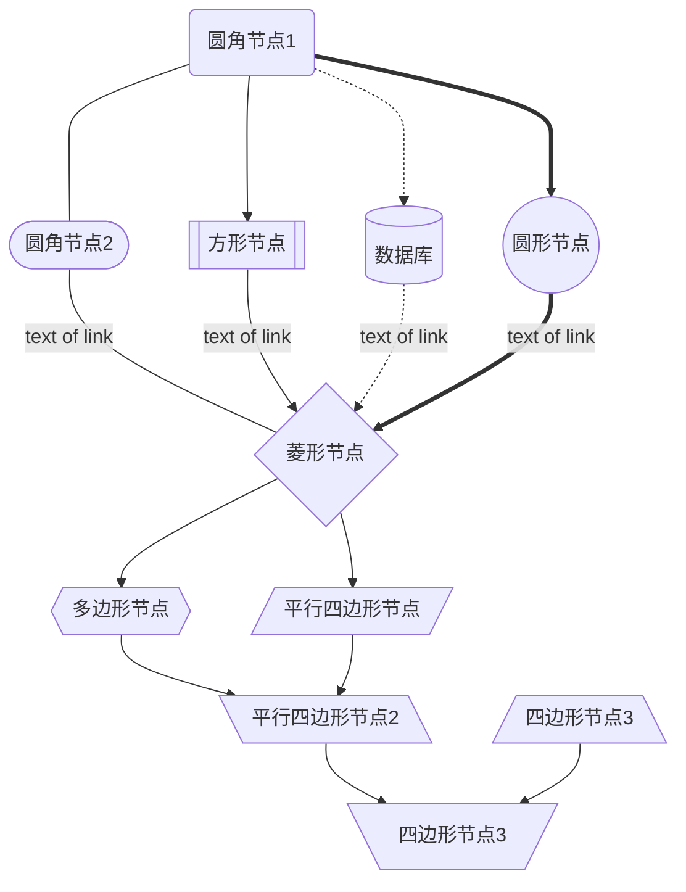

## flowchart 流程图

**schema**

```text
CHART_TYPE LAYOUT // # layout = TB TD BT RL LR
  NODE_ID#NODE_LABEL# // # => 图形标识开始和结束符
  NODE_ID#"NODE_LABEL"# // " => 可以加引号来escape文本
  NODE_ID-->NODE_ID // 配置连接 箭头可以配置为Arrow: [>, o, x, -]

  subgraph title // 子图形
    define
  end
```

**相关枚举参数**

* 布局
  * `TB | TD | BT | RL | LR`
* 链接
  * arrow: `> | o | x | -`
  * line: `--- -.- ===` // 可以根据字符长度表示实际渲染间距
* 节点
  * `(LABEL)` 小圆角
  * `([LABEL])` 半圆角
  * `((LABEL))` 圆形
  * `[[LABEL]]` 方形
  * `[(LABEL)]` 数据库
  * `>LABEL]` 标签
  * `{LABEL}` 菱形
  * `{{LABEL}}` 多边形
  * ...
* 逻辑链接
  * `A & B ---> C & D` = (A -> C) & (A -> D) & (B -> C) & (B -> D)

**DEMO**


