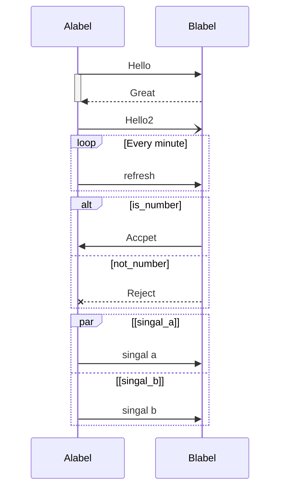

# 时序图 sequenceDiagram

**Schema**

* 角色
  * `participant id as label`
* 消息
  * `[A][line][B]: info`
* line
  * `->` 不带箭头的线
  * `-->` 不带箭头的虚线
  * `->>` 箭头的线
  * `-->>` 箭头的虚线
  * `-x` 带x的实线
  * `--x` 带)的虚线
  * `-)` 带)的虚线
* 状态
  * `activate A`
  * `deactivate A`
* 标签
  * `note [position] [A,...]: node_text`
  * position
    * `right of | left of | over`
* loops
  ```
    loop [loop_text]
      ...
    end
  ```
* alt - 条件选项
  if...else..
  ```
    alt [alt_text]
      ...
    else [alt_text]
      ...
    end
  ```
  if...
  ```
    opt [alt_text]
      ...
    end
  ```
* Parallel - 并行
  ```
    par [par_1]
    ...
    and [par_2]
    ...
    and [par_3]
    ...
    end
  ```
* Style - 样式
  * 背景颜色
    ```
      rect rgba(0, 0, 0, 1)
      ...
      end
    ```
* comments
  ```
    %% comments
  ```


