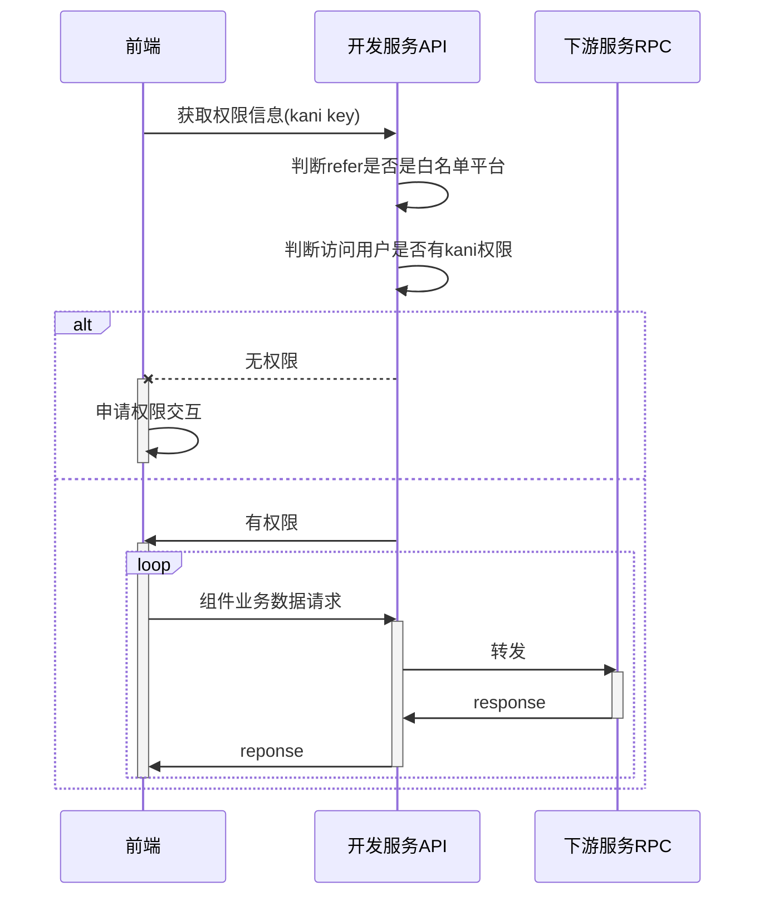
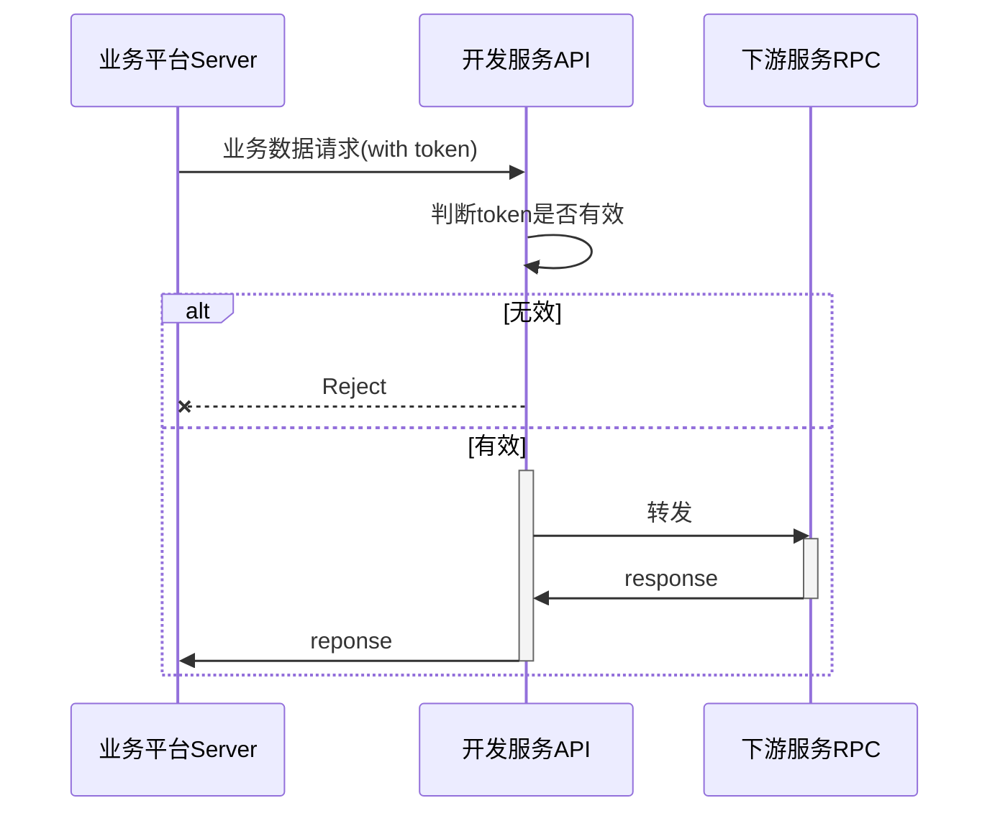

# 开放组件 - 前后端时序图

## 全部开放形态

* 接入方直接前端接入组件即可
* 接入条件
  * 申请业务白名单(业务安全评估后申请)

```mermaid
sequenceDiagram
  participant A as 前端
  participant B as 开发服务API
  participant C as 下游服务RPC

  A->>B: 获取权限信息(kani key)

  B->>B: 判断refer是否是白名单平台
  B->>B: 判断访问用户是否有kani权限

  alt
    B--xA: 无权限
    activate A
    A->>A: 申请权限交互
    deactivate A
  else
    B->>A: 有权限
    activate A

    loop
      A->>B: 组件业务数据请求
      activate B
      B->>C: 转发
      activate C
      C->>B: response
      deactivate C
      B->>A: reponse
      deactivate B
    end

    deactivate A
  end
```

## 开放服务形态

* 接入方前端自定义/后端接入开放服务
* 接入条件
  * 申请服务账号token(业务安全评估后申请)

```mermaid
sequenceDiagram
  participant A as 业务平台Server
  participant B as 开发服务API
  participant C as 下游服务RPC

  A->>B: 业务数据请求(with token)

  B->>B: 判断token是否有效

  alt 无效
    B--xA: Reject
  else 有效
    activate B
    B->>C: 转发
    activate C
    C->>B: response
    deactivate C
    B->>A: reponse
    deactivate B
  end
```
