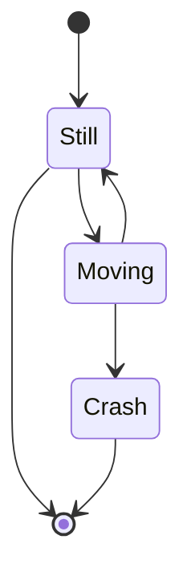

# 状态图 stateDiagram-v2

**Schema**

* direction
  * `direction LR`
* state
  * `state "state label" as s1`
  * `s1`
  * `s1 : "state label"`
* 流转
  * `s1 --> s2`
  * `s1 --> s2: a trasition`
* 开始/结束
  * `[*] --> s1`
  * `[s1] --> [*]`
* 组合
  ```
    state First {
      [*] --> fir
      fir --> [*]
    }

    state Second {}

    First --> Second
  ```
* choice
  ```
    state if_state <<choice>>
    [*] --> a
    a --> if_state
    if_state --> False: if n < 0
    if_state --> True: if n >= 0
  ```


